This article was born out of a day-to-day need, in short, at my workplace we are updating the infrastructure and some
technologies (which is beside the point now), but the problem is; we have more than 200 applications in production, how
to make all this run with spring-boot and in weblogic 12? (The idea here is to make the transition of technologies
little by little).

Many of the materials I’ve found on the internet are either outdated or simply don’t work for spring-boot 2.7.12 and
weblogic 12.2.1.3, or are simply too complicated for a novice developer to understand. The idea here is not to explain
each point of the configuration, class or lib, how it is done and how it works. The idea is that any dev, inciting or
not, can replicate the configuration, and have your application running with weblogic + spring-boot.

The structure I used in the project applies a concept of maven multi modules (if you are a beginner developer and don’t
know what I’m talking about, talk to your senior dev or search the internet about the advantages and disadvantages.
Maybe I’ll write an article about). Even using maven multi modules it is a simple structure, with 30 min studying the
code you will understand. For this article I used Intellij Community, although it has the Ultimate version, I want to
keep this article as generic as possible so that any dev can apply what was developed here in their reality.

----

### Project Structure

About the structure of the project, I developed two modules, api and core.

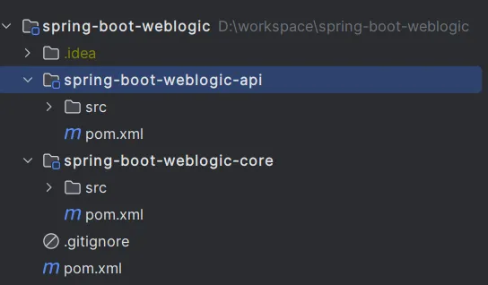

----

### Main Module

Let’s start with the parent project’s pom.xml. The idea here is to group the default settings for every project. I’m
using Java 8 and UTF-8 for the encoder, however, whether your project is legacy or not, it may have another encoder (
check before compiling, especially if your project is JSP).

````maven
<?xml version="1.0" encoding="UTF-8"?>
<project xmlns:xsi="http://www.w3.org/2001/XMLSchema-instance" xmlns="http://maven.apache.org/POM/4.0.0"
         xsi:schemaLocation="http://maven.apache.org/POM/4.0.0 https://maven.apache.org/xsd/maven-4.0.0.xsd">
    <modelVersion>4.0.0</modelVersion>
    <groupId>com.elbertribeiro</groupId>
    <artifactId>spring-boot-weblogic</artifactId>
    <version>0.0.1-SNAPSHOT</version>
    <name>spring-boot-weblogic</name>
    <modules>
        <module>spring-boot-weblogic-core</module>
        <module>spring-boot-weblogic-api</module>
    </modules>
    <packaging>pom</packaging>
    <properties>
        <java.version>1.8</java.version>
        <spring.boot.version>2.7.12</spring.boot.version>
        <maven.compiler.source>8</maven.compiler.source>
        <maven.compiler.target>8</maven.compiler.target>
        <project.build.sourceEncoding>UTF-8</project.build.sourceEncoding>
    </properties>
</project>
````

----

### Core Module

Now, going from bottom to top, in the spring-boot-weblogic-core module, we have the following structure:

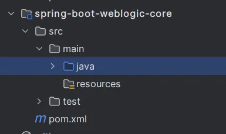

In spring-boot-weblogic-core’s pom.xml we will have:

````maven
<?xml version="1.0" encoding="UTF-8"?>
<project xmlns:xsi="http://www.w3.org/2001/XMLSchema-instance"
         xmlns="http://maven.apache.org/POM/4.0.0"
         xsi:schemaLocation="http://maven.apache.org/POM/4.0.0 http://maven.apache.org/xsd/maven-4.0.0.xsd">
    <modelVersion>4.0.0</modelVersion>
    <parent>
        <groupId>com.elbertribeiro</groupId>
        <artifactId>spring-boot-weblogic</artifactId>
        <version>0.0.1-SNAPSHOT</version>
    </parent>

    <artifactId>spring-boot-weblogic-core</artifactId>
    <dependencies>
        <!--SPRING BOOT-->
        <dependency>
            <groupId>org.springframework.boot</groupId>
            <artifactId>spring-boot-starter-web</artifactId>
            <version>${spring.boot.version}</version>
        </dependency>
        <dependency>
            <groupId>org.springframework.boot</groupId>
            <artifactId>spring-boot-starter-test</artifactId>
            <version>${spring.boot.version}</version>
            <scope>test</scope>
        </dependency>
    </dependencies>
</project>
````

Note that the pom.xml is simple, and the idea is that it contains the dependencies for the api module.

Inside the JAVA directory we have only one package (as the idea here is just to present a functional concept, this model
is as simple as possible).

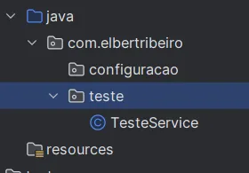

In the test package we have the TesteService class, which would work as a Service layer for the api. In TesteService, we
have the following code;

````java
package com.elbertribeiro.teste;

import org.springframework.stereotype.Service;

@Service
public class TesteService {
    public String retornoService() {
        return "Teste Weblogic com multiModules e service e @Autowired";
    }
}
````

Note that the added dependency in spring-boot-weblogic-core’s pom.xml allows us to use Annotations normally. The core
module is simple for the purpose of this article, now let’s move on to the more interesting part.

### API module

Now, let’s go to the spring-boot-weblogic-api module, we have the following structure:

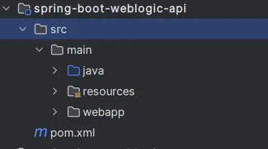

The first point to note is that the api module has more files, because it will contain the class that initializes the
project in spring-boot and will also be implemented in weblogic.

In the spring-boot-weblogic-api pom.xml we will have:

````maven
<?xml version="1.0" encoding="UTF-8"?>
<project xmlns:xsi="http://www.w3.org/2001/XMLSchema-instance" xmlns="http://maven.apache.org/POM/4.0.0"
         xsi:schemaLocation="http://maven.apache.org/POM/4.0.0 https://maven.apache.org/xsd/maven-4.0.0.xsd">
    <modelVersion>4.0.0</modelVersion>
    <parent>
        <groupId>com.elbertribeiro</groupId>
        <artifactId>spring-boot-weblogic</artifactId>
        <version>0.0.1-SNAPSHOT</version>
    </parent>

    <artifactId>spring-boot-weblogic-api</artifactId>
    <packaging>war</packaging>

    <dependencies>
        <!-- Dependencia dos modulos -->
        <dependency>
            <groupId>${project.parent.groupId}</groupId>
            <artifactId>${project.parent.artifactId}-core</artifactId>
            <version>${project.parent.version}</version>
        </dependency>

        <!--SPRING BOOT-->
        <dependency>
            <groupId>org.springframework.boot</groupId>
            <artifactId>spring-boot-starter-tomcat</artifactId>
            <version>${spring.boot.version}</version>
            <scope>provided</scope>
        </dependency>
        <dependency>
            <groupId>org.springframework.boot</groupId>
            <artifactId>spring-boot-devtools</artifactId>
            <version>${spring.boot.version}</version>
            <scope>runtime</scope>
            <optional>true</optional>
        </dependency>
    </dependencies>

    <build>
        <plugins>
            <plugin>
                <groupId>org.springframework.boot</groupId>
                <artifactId>spring-boot-maven-plugin</artifactId>
                <version>${spring.boot.version}</version>
            </plugin>
            <plugin>
                <groupId>org.apache.maven.plugins</groupId>
                <artifactId>maven-war-plugin</artifactId>
                <version>3.3.2</version>
                <configuration>
                    <webResources>
                        <resource>
                            <directory>src/main/webapp</directory>
                        </resource>
                    </webResources>
                </configuration>
            </plugin>
        </plugins>
    </build>
</project>
````

If you paid attention to the parent module, you noticed that the spring-boot versions were defined globally and the
modules only refer to the specified version.

The most important dependency here is:


It will be responsible for allowing us to use the project with spring-boot even adding configurations to run in
weblogic.

Also note that we have the core module of the project as a dependency, allowing access to any class, method or entity
added in the core module:

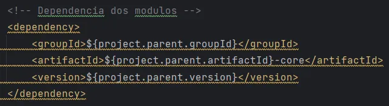

We also have devtoos as a dependency, for those who don’t know it’s a lib that allows a browser update when a resource
is changed at compile time, removing the need to restart your spring-boot service.

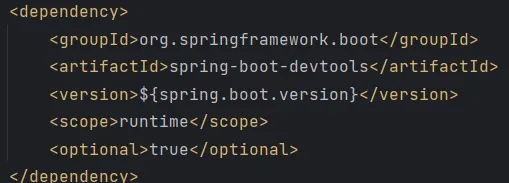

If you looked at the spring-boot-weblogic-api pom.xml you might have noticed two plugins:

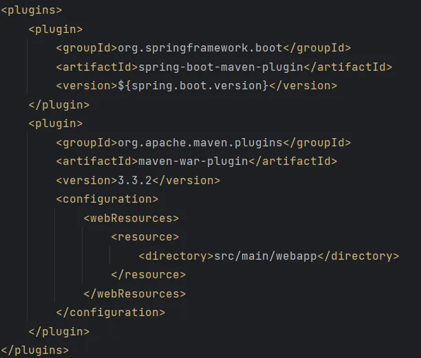

The first allows you to run spring-boot commands like mvn spring-boot:run, while the second plugin is responsible for
collecting and compiling all dependencies, classes and resources of the web application into a web application file,
generating an artifact of type *.war.

I understand that I said I wouldn’t explain every lib configuration point and operation, but understanding how the
dependencies work and when they will be used is important, this prevents your system from evolving by applying
responsibilities where it shouldn’t.

Now let’s go to the “interesting part”, let’s add some configurations for the application to run in weblogic, however, I
recommend that you research how each configuration works and why it exists. With that, I hope to partially fulfill the
promise of not explaining how libs and configurations work (we can write an article explaining how they work soon).

About the resources directory, we only have an empty *.yml properties file. Already in the webapp directory, we have the
files that allow you to add your application to weblogic, for the structure of the packages we have:

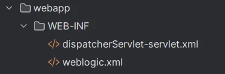

In the weblogic.xml file we have;

````maven
<?xml version="1.0" encoding="UTF-8"?>
<wls:weblogic-web-app
        xmlns:wls="http://xmlns.oracle.com/weblogic/weblogic-web-app"
        xmlns:xsi="http://www.w3.org/2001/XMLSchema-instance"
        xsi:schemaLocation="http://xmlns.oracle.com/weblogic/weblogic-web-app
        http://xmlns.oracle.com/weblogic/weblogic-web-app/1.4/weblogic-web-app.xsd">

    <wls:context-root>spring-boot-weblogic</wls:context-root>
    <wls:container-descriptor>
        <wls:prefer-application-packages>
            <wls:package-name>org.slf4j.*</wls:package-name>
            <wls:package-name>org.springframework.*</wls:package-name>
        </wls:prefer-application-packages>
    </wls:container-descriptor>
</wls:weblogic-web-app>
````

In the webapp directory we also have the file dispatcherServlet-servlet.xml;

````maven
<?xml version="1.0" encoding="UTF-8"?>
<beans xmlns="http://www.springframework.org/schema/beans"
       xmlns:xsi="http://www.w3.org/2001/XMLSchema-instance"
       xsi:schemaLocation="http://www.springframework.org/schema/beans
    http://www.springframework.org/schema/beans/spring-beans.xsd">

</beans>
````

And finally, we have the file structure of the JAVA directory:

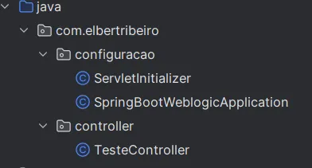

Where the ServletInitializer class has only one method:

````java
package com.elbertribeiro.configuracao;

import org.springframework.boot.builder.SpringApplicationBuilder;
import org.springframework.boot.web.servlet.support.SpringBootServletInitializer;

public class ServletInitializer extends SpringBootServletInitializer {

    @Override
    protected SpringApplicationBuilder configure(SpringApplicationBuilder application) {
        return application.sources(SpringBootWeblogicApplication.class);
    }

}
````

The configure method is used to configure the spring-boot application to add to an external application server such as
weblogic. It takes a SpringApplicationBuilder object as a parameter and returns an instance of it.

The configure method is being replaced to configure the SpringBootWeblogicApplication application as the spring-boot
application source. This means that the SpringApplicationBuilder is being configured to load the configuration and
components of that specific application when deploying to weblogic.

And we also have the class contains the main method, responsible for initializing our spring-boot application.

````java
package com.elbertribeiro.configuracao;

import org.springframework.boot.SpringApplication;
import org.springframework.boot.autoconfigure.SpringBootApplication;
import org.springframework.context.annotation.ComponentScan;

@SpringBootApplication
@ComponentScan(basePackages = "com.elbertribeiro")
public class SpringBootWeblogicApplication {

    public static void main(String[] args) {
        SpringApplication.run(SpringBootWeblogicApplication.class, args);
    }

}
````

And as resources, we have only one endpoint that is present in the TesteController class;

````java
package com.elbertribeiro.controller;

import com.elbertribeiro.teste.TesteService;
import org.springframework.beans.factory.annotation.Autowired;
import org.springframework.web.bind.annotation.GetMapping;
import org.springframework.web.bind.annotation.RequestMapping;
import org.springframework.web.bind.annotation.RestController;

@RestController
@RequestMapping("teste")
public class TesteController {
    @Autowired
    private TesteService service;

    @GetMapping
    public String getTest() {
        return service.retornoService();
    }
}
````

I hope the article didn’t get too long, before finalizing it lacks proof that all this works 😂.

----

### Running the application with spring-boot

To run this project with spring-boot run the command below in the spring-boot-weblogic-api module

````maven
mvn spring-boot:run
````

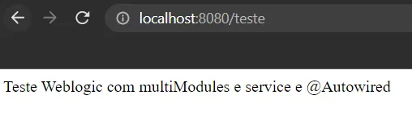

### Running the application with Weblogic

Upload the artifact to weblogic and access the weblogic address with the path of your application.

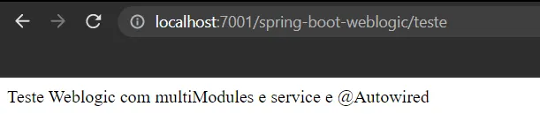

### Conclusion

Well, it is true that using a multi-module maven project may not seem interesting at first, but it helps a lot,
especially when we are talking about scalable software, if necessary, you can delete the core module, just pass the
dependency to the module api move our classes to the api module as well.

The code for the developed project is here: https://github.com/ElbertRibeiro/spring-boot-weblogic/tree/artigo-medium

Below I will put my social networks, feel free to comment or discuss any topic addressed in this project.

### References

* https://www.baeldung.com/maven-generate-war-file

* https://o7planning.org/11901/deploy-spring-boot-application-on-oracle-weblogic-server